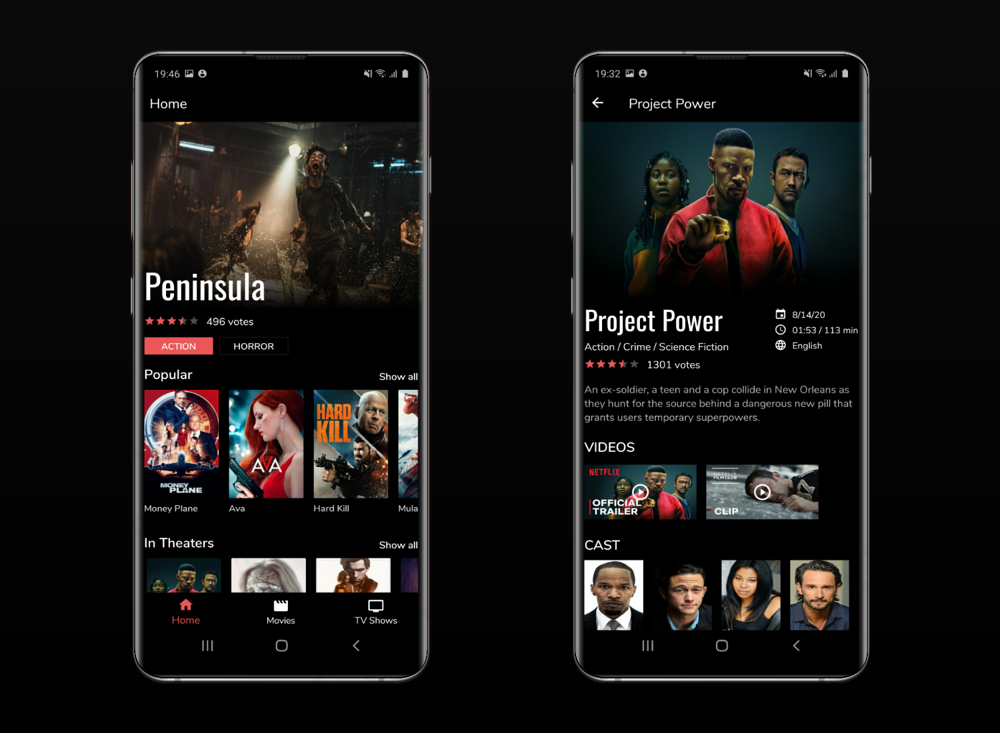
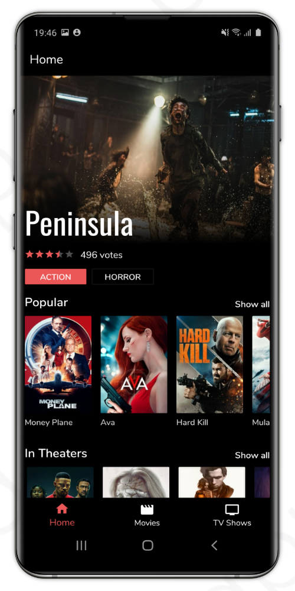
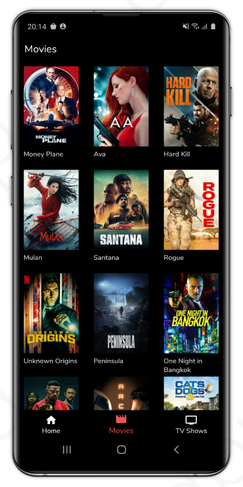
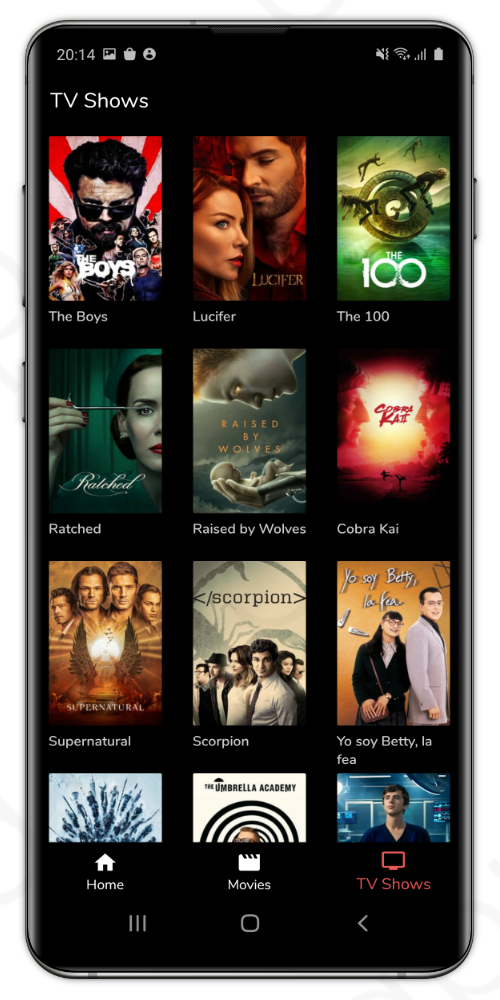
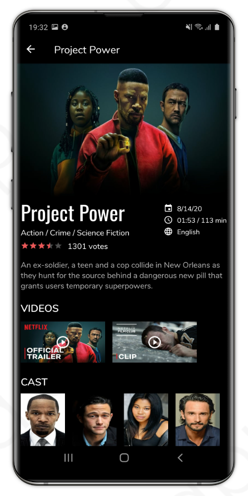
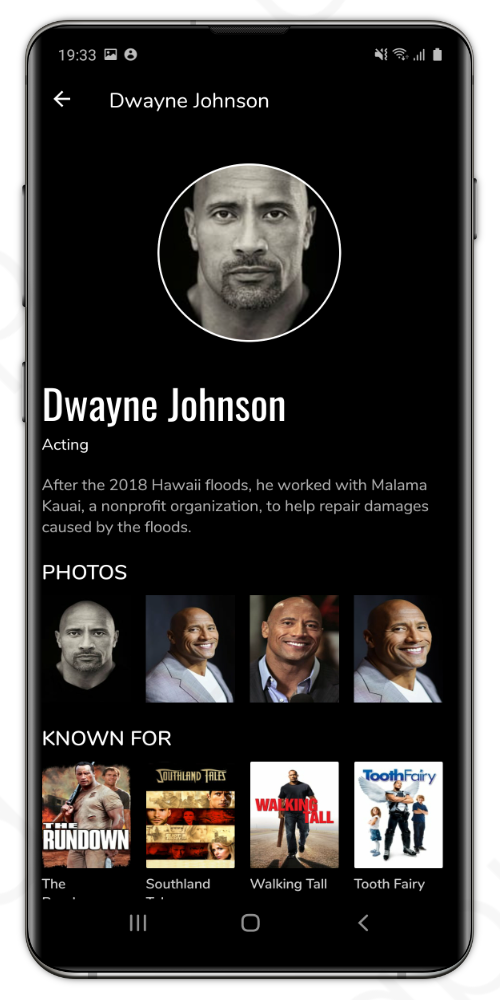

# Movie App Android
 

## Introduction
This is a demo application built with the goal to create a fun and challenging application based on the MVVM architectural pattern using [The Movie Database](https://www.themoviedb.org/).

See below for more information.

## Technologies & Architecture 

#### Technologies
* Android, Kotlin
* [The Movie Database](https://www.themoviedb.org/)
* [Retrofit HTTP Client](https://square.github.io/retrofit/) 
* [OkHttp](https://square.github.io/okhttp/) - Interceptor
* [Picasso](https://square.github.io/picasso/) - Loading images, caching

#### Architecture
Model-View-ViewModel (MVVM)

#### Architecture Components
[ViewModel](https://developer.android.com/topic/libraries/architecture/viewmodel), [LiveData](https://developer.android.com/topic/libraries/architecture/livedata), [DataBinding](https://developer.android.com/topic/libraries/data-binding), 
[Navigation](https://developer.android.com/guide/navigation/)

## Features
**Home:** Highlighted movie and lists of popular, in theaters and upcoming movies

**Movies:** Discover movies

**TV Shows:** Discover tv shows

**Show all:** Show movie list based on type (popular, in theaters, upcoming)

**Movie details:** Title, genres, rating, overview, date, runtime, language, videos, and cast

**TV Show details:** Title, genres, rating, overview, date, episodes, seasons, videos and cast

**Person details:** Name, biography, photos and known for movies/tv shows

**General:** Infinite scrolling lists, bottom navigation, error messages with snackbar, progress bar

## Screenshots

### Bottom navigation

  
   
   

### Movie | TV Show | Person

  
   
   

## Setup

#### Requirements
* Basic knowledge about Android Studio

#### The Movie Database API
1. Sign up and retrieve a API key from [The Movie Database API](https://www.themoviedb.org/documentation/api) 

#### Project
1. Download and open the project in Android Studio
2. Edit the file local.properties and add the line: tmdb_api_key="YOUR_KEY"
3. Connect your Android phone or use the emulator to start the application
